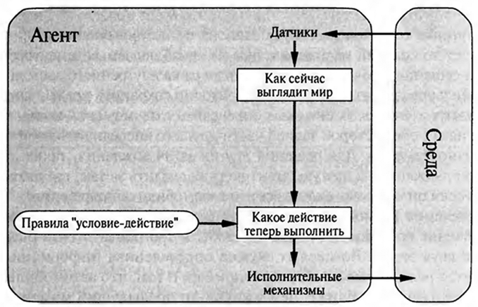
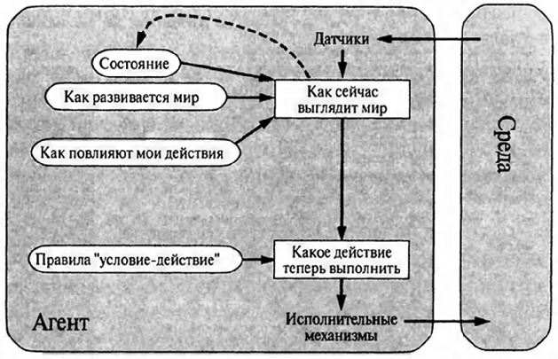
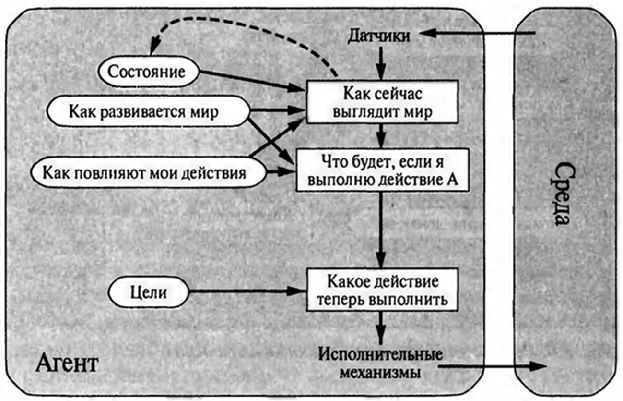
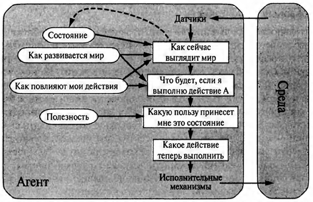
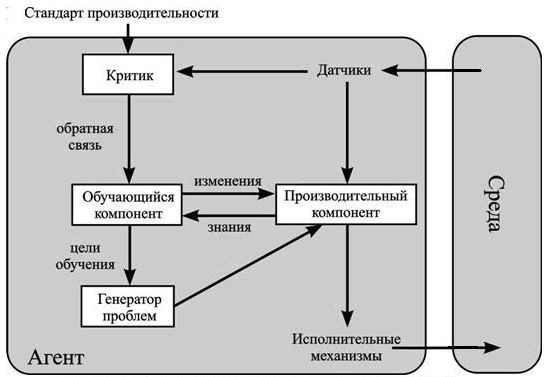

_**Disclaimer:** Содержит левые материалы из интернета_

**`DEFs`**  
**Агент** - всё, что может рассматриваться как воспринимающее окружающую среду с помощью датчиков и умеющую влиять на неё. `Агент = Архитектура + Программа`

**Программа агента** - конкретная реализация.

**Показатели производительности** - критерии оценки успешного поведения агента.

**Рациональность** - в любой момент оценка рациональности агента зависит от 4х факторов:
1. Показатель производительности
2. Знание агента о среде, приобретённое ранее
3. Действия, которые могут быть выполнены
4. Последствия актов восприятия агента

### Виды агентов:

#### 1. Простые рефлексные
Является простейшим видом агента. Подобные агенты выбирают действия на основе текущего акта восприятия, игнорируя всю остальную историю актов восприятия.
Очень просты, очень надёжны, но ограниченный интеллект.

#### 2. Рефлексные, основанные на модели
Одним из наиболее эффективных способов организации работы в условиях частичной наблюдаемости, является отслеживаемость агентом той части мира, которая воспринимается им в данный момент времени. Это означает, что агент должен поддерживать внутреннее состояние, зависящее от истории актов восприятия и отражать некоторые из ненаблюдаемых аспектов текущего состояния. Для обновления внутренней информации о состоянии в программе агента используются знания двух видов. Во-первых, информация о том, как изменяется мир независимо от агента, а во-вторых, информация о том, как действия агента влияют на окружающий мир. На основе первого вида информации строится модель мира.

#### 3. Действующие на основе цели
 В реальной жизни для принятия решения не всегда достаточно информации из окружающей среды. Так, например, человек подходит к перекрестку, у него есть на выбор три направления движения, выбор направления зависит от цели. То есть, агенту требуется не только информация о мире, внутреннем состоянии, но и информация о цели, которая будет описывать желаемые ситуации. Программа агента может комбинировать эти виды информации для выбора действий, которые позволят достичь цели.

#### 4. Действующие на основе полезности
В действительности в большинстве вариантов среды для выработки высококачественного поведения одного лишь учета целей недостаточно. Цели позволяют провести лишь жесткое бинарное различие между состояниями «удовлетворенности» и «неудовлетворенности», тогда как более общие показатели производительности должны обеспечивать сравнение различных состояний мира в точном соответствии с тем, насколько удовлетворенным станет агент, если их удастся достичь.

Функция полезности отображает состояние (или последовательность состояний) на вещественное число, которое обозначает соответствующую степень удовлетворенности агента. Полная спецификация функции полезности обеспечивает возможность принимать рациональные решения в описанных ниже двух случаях, когда этого не позволяют сделать цели:
- если имеются конфликтующие цели, такие, что могут быть достигнуты только некоторые из них (например, или скорость, или безопасность), то функция полезности позволяет найти приемлемый компромисс;
- если имеется несколько целей, к которым может стремиться агент, но ни одна из них не может быть достигнута со всей определенностью, то функция полезности предоставляет удобный способ взвешенной оценки вероятности успеха с учетом важности целей.

### Обучающиеся агенты
Рассмотренные виды агентов имеют один общий недостаток. Этим недостатком является то, что агенты не могут обучаться, что является серьезным изъяном в интеллектуальных системах.

Обучающийся агент имеет четыре компонента.  
**Критик** - выполняет функции оценщика действий агента с учетом постоянного стандарта производительности. Критик необходим в данной структуре, поскольку сам агент не понимает успешны ли его действия или нет. Стандарт производительности должен быть постоянным.  
**Обучающий компонент** отвечает за внесение усовершенствований, а **производительный компонент** за выбор внешних действий. Обучающий компонент использует информацию от критика с оценкой того, как действует агент, и определяет его дальнейшие действия. Обучающий компонент полностью зависит от производительного компонента. В моделировании такого агента прежде всего нужно получить ответ на вопрос: «Какой производительный компонент потребуется» моему агенту, после того как он обучится выполнять свои функции?».  
**Генератор проблем** – служит для выбора действий, которые должны привести к получению совершенно нового информационного опыта. Поскольку производительный компонент выбирает только наилучшие действия, то возможно в один момент, производственный компонент будет использовать одни и те же действия все время, полагая что они являются наилучшими, а генератор проблем служит для выбора менее оптимальных действий в начале, но возможно наилучших в конечном результате. То есть генератор проблем предназначен для того, чтобы система смогла экспериментировать, находя наилучшие решения.