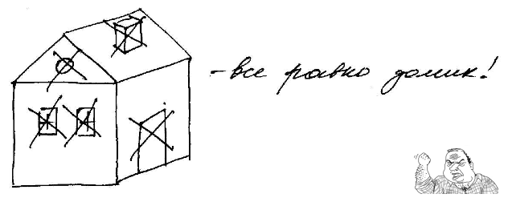

### Фреймы

**`DEF`**
В психологии **фрейм** – абстрактный образ для представления некоторого стереотипа восприятия. Фрейм – то минимально необходимое, без чего не существует явление, объект или процесс, о котором идёт речь. 
Изначально фрейм задумывался как стереотип восприятия. Фрейм имеет имя и состоит из слотов (пустот).



Типы фреймов:
- Структурные фреймы
- Ролевые фреймы

Как можно представлять фреймы:
```
{
    Имя фрейма,
    Имя слота,
    Значение слота,
    Способ получения значения,
    Присоединённые процедуры
}
```
### Способы получения слотом значения во фрейме-экземпляре:
- По умолчанию
- Через наследование свойств от фрейма, имя которого указано в слоте с именем AKO (a kind of)
- По формуле, указанной в слоте
- Через присоединённую процедуру
    * Процедуры-демоны – активируются автоматически каждый раз когда данные попадают в соответствующий фрейм-экземпляр или удаляются из него. С помощью демонов автоматически выполняются все рутинные операции, связанные с ведением баз данных и знаний
    * Процедуры-слуги – активируются только по запросу
- Через диалог с пользователем
- Из базы данных

Слот **AKO** (*a kind of*) - имя более высокого по иерархии фрейма, от которого
неявно наследуются слоты  
Слот **Instance** содержит имена фреймов-потомков.

### Пример фреймов с наследованием:


### Пример фрейма сценария:
| Имя                     |      Регистрация                       |
|-------------------------|----------------------------------------|
| **участники**           | клиент, администратор                  |
| **действия участников** | предъявить, написать, заполнить (...)  |
| **объекты действия**    | паспорт, удостоверение личности, регистрационная форма, регистрационный журнал, комната, этаж, ключ |
| **место действия**      | вестибюль                              |

Языки:
- FRL (Frame Representation Language),
- KRL (Knowledge Representation Language).

### *Полезная литература*
- Д.А.Поспелов - "Ситуационное правление"